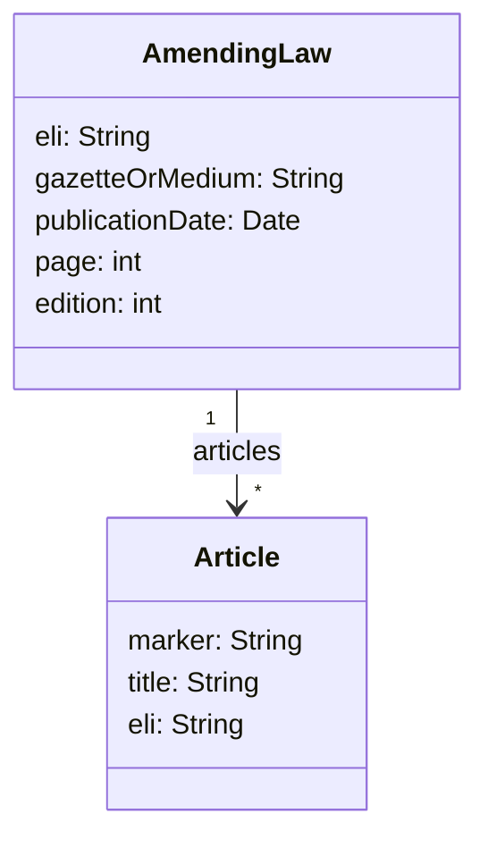

# Domain diagram

```mermaid
classDiagram

AmendingLaw "1" --> "*" Article: articles

class AmendingLaw{
    eli: String
    gazetteOrMedium: String
    publicationDate: Date
    page: int
    edition: int
}
class Article{
    marker: String
    title: String
    eli: String
}
```
