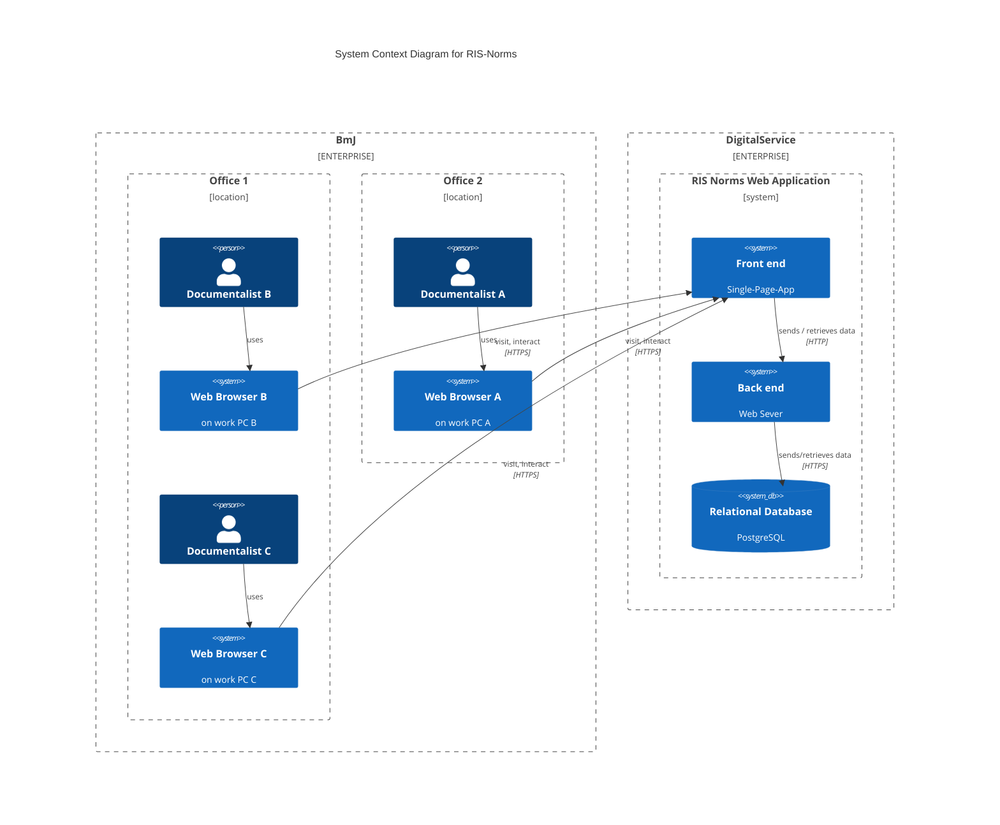

<!-- 

    Available Macros on the System Context level
    (cf. https://github.com/plantuml-stdlib/C4-PlantUML/blob/master/README.md#system-context--system-landscape-diagrams)

    Person(alias, label, ?descr, ?sprite, ?tags, ?link, ?type)
    Person_Ext(alias, label, ?descr, ?sprite, ?tags, ?link, ?type)
    System(alias, label, ?descr, ?sprite, ?tags, ?link, ?type, ?baseShape)
    SystemDb(alias, label, ?descr, ?sprite, ?tags, ?link, ?type)
    SystemQueue(alias, label, ?descr, ?sprite, ?tags, ?link, ?type)
    System_Ext(alias, label, ?descr, ?sprite, ?tags, ?link, ?type, ?baseShape)
    SystemDb_Ext(alias, label, ?descr, ?sprite, ?tags, ?link, ?type)
    SystemQueue_Ext(alias, label, ?descr, ?sprite, ?tags, ?link, ?type)
    Boundary(alias, label, ?type, ?tags, ?link)
    Enterprise_Boundary(alias, label, ?tags, ?link)
    System_Boundary(alias, label, ?tags, ?link) -->

