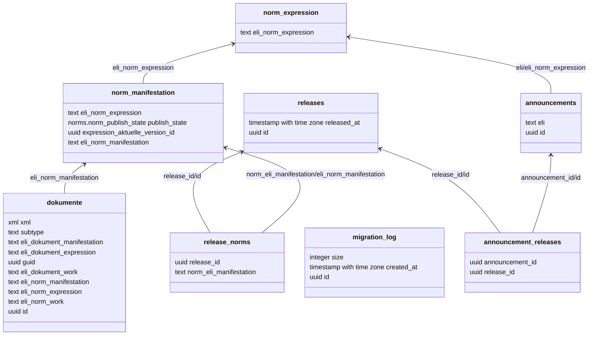

# Database model

```mermaid
classDiagram
direction BT
class announcement_releases {
   uuid announcement_id
   uuid release_id
}
class announcements {
   text eli
   uuid id
}
class dokumente {
   xml xml
   text subtype
   text eli_dokument_manifestation
   text eli_dokument_expression
   uuid guid
   text eli_dokument_work
   text eli_norm_manifestation
   text eli_norm_expression
   text eli_norm_work
   uuid id
}
class migration_log {
   integer size
   timestamp with time zone created_at
   uuid id
}
class norm_expression {
   text eli_norm_expression
}
class norm_manifestation {
   text eli_norm_expression
   norms.norm_publish_state publish_state
   uuid expression_aktuelle_version_id
   text eli_norm_manifestation
}
class release_norms {
   uuid release_id
   text norm_eli_manifestation
}
class releases {
   timestamp with time zone released_at
   uuid id
}

announcement_releases  -->  announcements : announcement_id/id
announcement_releases  -->  releases : release_id/id
announcements  -->  norm_expression : eli/eli_norm_expression
dokumente  -->  norm_manifestation : eli_norm_manifestation
norm_manifestation  -->  norm_expression : eli_norm_expression
release_norms  -->  norm_manifestation : norm_eli_manifestation/eli_norm_manifestation
release_norms  -->  releases : release_id/id
```
