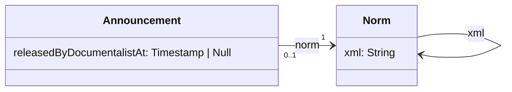

# Domain model

```mermaid
classDiagram

direction LR

class Norm {
    xml: String
}

class Announcement {
    releasedByDocumentalistAt: Timestamp | Null
}

Announcement "0..1" --> "1" Norm: norm
Norm --> Norm: xml
```
