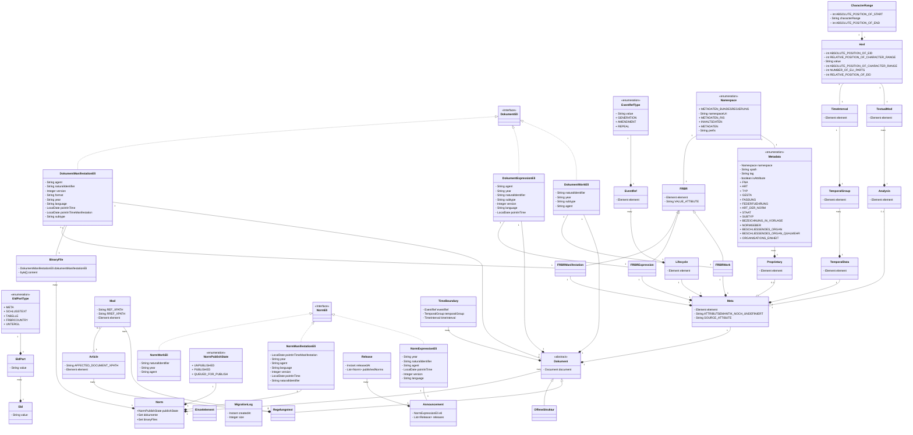

# Domain model

```mermaid
classDiagram
direction BT
class Analysis {
- Element element
  }
  class Announcement {
- NormExpressionEli eli
- List~Release~ releases
  }
  class Article {
- String AFFECTED_DOCUMENT_XPATH
- Element element
  }

class BinaryFile {
- DokumentManifestationEli dokumentManifestationEli
- byte[] content
  }
  class CharacterRange {
  ~ int ABSOLUTE_POSITION_OF_START
- String characterRange
  ~ int ABSOLUTE_POSITION_OF_END
  }
  class Dokument {
  <<abstract>>
- Document document
  }
  class DokumentEli {
  <<Interface>>
  }

class DokumentExpressionEli {
- String agent
- String year
- String naturalIdentifier
- String subtype
- Integer version
- String language
- LocalDate pointInTime
  }
  class DokumentManifestationEli {
- String agent
- String naturalIdentifier
- Integer version
- String format
- String year
- String language
- LocalDate pointInTime
- LocalDate pointInTimeManifestation
- String subtype
  }
  class DokumentWorkEli {
- String naturalIdentifier
- String year
- String subtype
- String agent
  }
  class EId {
- String value
  }
  class EIdPart {
- String value
  }
  class EIdPartType {
  <<enumeration>>
+  META
+  SCHLUSSTEXT
+  TABELLE
+  FRBRCOUNTRY
+  UNTERGL
   %% Further values omitted%%
   }
   class Einzelelement
   class EventRef {
- Element element
  }
  class EventRefType {
  <<enumeration>>
  ~ String value
+  GENERATION
+  AMENDMENT
+  REPEAL
   }
   class FRBR {
- Element element
- String VALUE_ATTIBUTE
  }
  class FRBRExpression
  class FRBRManifestation
  class FRBRWork
  class Href {
  ~ int ABSOLUTE_POSITION_OF_EID
  ~ int RELATIVE_POSITION_OF_CHARACTER_RANGE
- String value
  ~ int ABSOLUTE_POSITION_OF_CHARACTER_RANGE
  ~ int NUMBER_OF_ELI_PARTS
  ~ int RELATIVE_POSITION_OF_EID
  }
  class Lifecycle {
- Element element
  }
  class Meta {
- Element element
- String ATTRIBUTSEMANTIK_NOCH_UNDEFINIERT
- String SOURCE_ATTIBUTE
  }


  class MigrationLog {
- Instant createdAt
- Integer size
  }
  class Mod {
- String REF_XPATH
- String RREF_XPATH
- Element element
  }
  class Namespace {
  <<enumeration>>
+  METADATEN_BUNDESREGIERUNG
- String namespaceUri
+  METADATEN_RIS
+  INHALTSDATEN
+  METADATEN
- String prefix
  }
  class Norm {
  +NormPublishState publishState
  +Set<Dokument> dokumente
  +Set<BinaryFile> binaryFiles
  }
  class NormEli {
  <<Interface>>

}
class NormExpressionEli {
- String year
- String naturalIdentifier
- String agent
- LocalDate pointInTime
- Integer version
- String language
  }
  class NormManifestationEli {
- LocalDate pointInTimeManifestation
- String year
- String agent
- String language
- Integer version
- LocalDate pointInTime
- String naturalIdentifier
  }
  class NormPublishState {
  <<enumeration>>
+  UNPUBLISHED
+  PUBLISHED
+  QUEUED_FOR_PUBLISH
   }
   class NormWorkEli {
- String naturalIdentifier
- String year
- String agent
  }
  class OffeneStruktur
  class Proprietary {
- Element element
  }
  class Metadata {
  <<enumeration>>
- Namespace namespace
- String xpath
- String tag
- boolean isAttribute
+ FNA
+ ART
+ TYP
+ GESTA
+ FASSUNG
+ FEDERFUEHRUNG
+ ART_DER_NORM
+ STAAT
+ SUBTYP
+ BEZEICHNUNG_IN_VORLAGE
+ NORMGEBER
+ BESCHLIESSENDES_ORGAN
+ BESCHLIESSENDES_ORGAN_QUALMEHR
+ ORGANISATIONS_EINHEIT
}
  class Regelungstext
  class Release {
- Instant releasedAt
- List~Norm~ publishedNorms
  }
  class TemporalData {
- Element element
  }
  class TemporalGroup {
- Element element
  }
  class TextualMod {
- Element element
  }
  class TimeBoundary {
- EventRef eventRef
- TemporalGroup temporalGroup
- TimeInterval timeInterval
  }
  class TimeInterval {
- Element element
  }


NormExpressionEli  ..|>  NormEli
NormManifestationEli  ..|>  NormEli
NormWorkEli  ..|>  NormEli

DokumentWorkEli ..|> DokumentEli
DokumentExpressionEli ..|> DokumentEli
DokumentManifestationEli ..|> DokumentEli

FRBRWork --|> FRBR
FRBRExpression --|> FRBR
FRBRManifestation --|> FRBR

Regelungstext --|> Dokument
OffeneStruktur --|> Dokument

Norm "1" *-- "1" NormPublishState
Norm "1" *-- "many" Dokument
Norm "1" *-- "many" BinaryFile
Norm "1" *-- "1" NormManifestationEli

Announcement "1" -- "1" NormExpressionEli
Announcement "1" *-- "many" Release

Dokument "1" *-- "1" DokumentWorkEli
Dokument "1" *-- "1" DokumentExpressionEli
Dokument "1" -- "1" DokumentManifestationEli
BinaryFile "1" -- "1" DokumentManifestationEli

Regelungstext "1" *-- "many" Article

EId "1" *-- "many" EIdPart
EIdPart "1" *-- "1" EIdPartType
Href "1" *-- "1" CharacterRange
TextualMod "1" -- "1" Href
TimeInterval "1" -- "1" Href

Dokument "1" *-- "1" Meta
Meta "1" *-- "1" FRBRWork
FRBRWork "1" -- "1" DokumentWorkEli
Meta "1" *-- "1" FRBRExpression
FRBRExpression "1" -- "1" DokumentExpressionEli
Meta "1" *-- "1" FRBRManifestation
FRBRManifestation "1" -- "1" DokumentManifestationEli
Meta "1" o-- "0..1" Analysis
Analysis "1" *-- "many" TextualMod
Meta "1" *-- "1" Lifecycle
Lifecycle "1" *-- "many" EventRef
EventRef "1" *-- "1" EventRefType
Meta "1" *-- "1" TemporalData
TemporalData "1" *-- "many" TemporalGroup
TemporalGroup "1" *-- "1" TimeInterval
Meta "1" o-- "0..1" Proprietary
Proprietary "1" *-- "many" Metadata
Metadata "1" -- "1" Namespace

Regelungstext "0" *-- "many" Mod
Article "1" o-- "0..1" Mod

FRBR "1" -- "1" Namespace
Dokument "0" *-- "many" TimeBoundary
```
