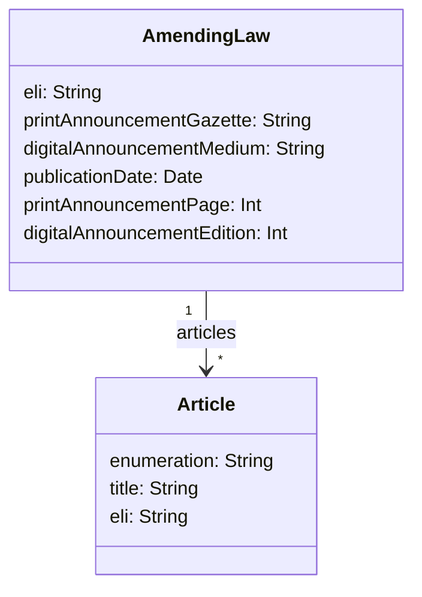

# Domain model

```mermaid
classDiagram

AmendingLaw "1" --> "*" Article: articles

class AmendingLaw{
    eli: String
    printAnnouncementGazette: String
    digitalAnnouncementMedium: String
    publicationDate: Date
    printAnnouncementPage: Int
    digitalAnnouncementEdition: Int
}
class Article{
    enumeration: String
    title: String
    eli: String
}
```
