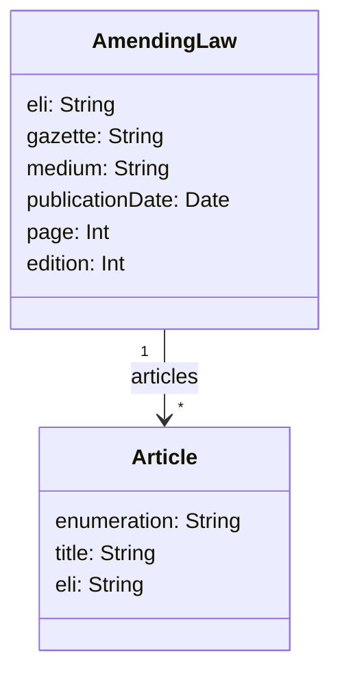

# Domain model

```mermaid
classDiagram

AmendingLaw "1" --> "*" Article: articles

class AmendingLaw{
    eli: String
    gazette: String
    medium: String
    publicationDate: Date
    page: Int
    edition: Int
}
class Article{
    enumeration: String
    title: String
    eli: String
}
```
