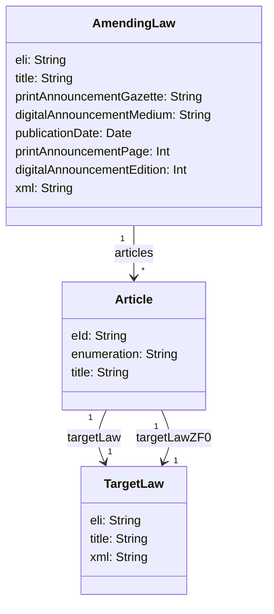

# Domain model

```mermaid
classDiagram

AmendingLaw "1" --> "*" Article: articles

class AmendingLaw{
    eli: String
    title: String
    printAnnouncementGazette: String
    digitalAnnouncementMedium: String
    publicationDate: Date
    printAnnouncementPage: Int
    digitalAnnouncementEdition: Int
    xml: String
}

class Article{
    eId: String
    enumeration: String
    title: String
}

Article "1" --> "1" TargetLaw: targetLaw
Article "1" --> "1" TargetLaw: targetLawZF0

class TargetLaw{
    eli: String
    title: String
    xml: String
}

```
